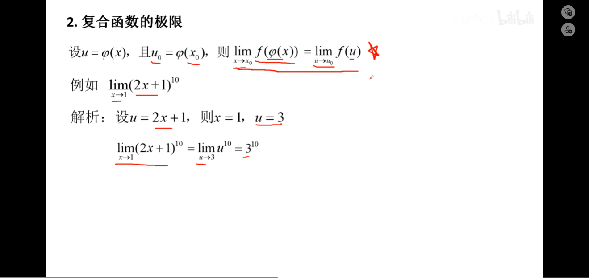
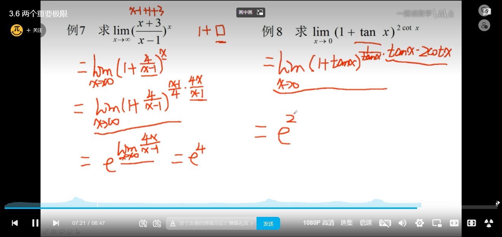
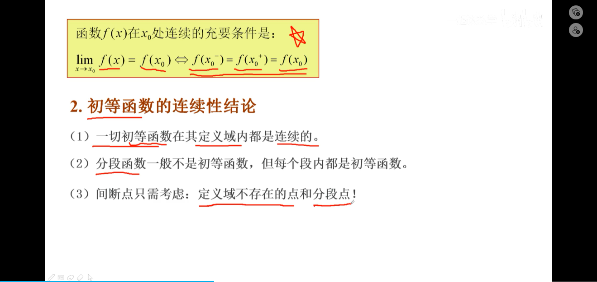

# 极限与连接

[TOC]

## 极限的概念

### 数列的极限

#### x-->∞时函数f(x)的极限

#### x-->x0时函数f(x)的极限

#### 函数的左极限、右极限

#### 例：

## 极限的性质与运算

### 极限的四则运算法则

#### 例：

### 复合函数的极限

### 基本未定式极限

#### **抓大放小（无穷比无穷的时候可以用）**

### 例：

## 无穷小量与无穷大量

### 无穷小量

#### 注意

#### 无穷小的性质：

### 无穷大量：

#### 例：

## 例题：

## 两个重要极限

## 夹逼准则

## 函数的连续性

### 连续的定义

#### 例：

#### 函数的间断点

#### 例：

## 极限在经济生活中的应用

# 函数与反函数

## 反函数

### 反函数的性质

## 初等函数

### 反三角函数

